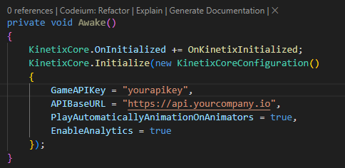

# Kinetix SDK Server (On-premises deployment)

> [!WARNING]  
> This code is currently in the development phase.
> Not all features are complete, and there may be bugs.
> It is not ready yet for production deployment.

Welcome to the Kinetix Emote Generation Platform.
Our AI-powered infrastructure generates dynamic and expressive emotes for in-game characters, enhancing the gaming experience.

# Overview

Kinetix has made it easy to create in-game emotes using AI.
Our platform, previously available only as a SaaS product, now also supports on-premises deployment.
Here you will find everything related to on-premises deployment.

## Components

Core API with PWA

Dev portal

Webhook server

# Quick start

To start from scratch with all the infrastructure components and apis :

```sh
docker compose up
```

> [!IMPORTANT]
> Do not forget to update your game build to target your own new infrastructure
> 

## Run locally from the sources

You will need to have installed on your local computer:

- [nodeJS](https://nodejs.org/) (minimum v20)
- [docker](https://www.docker.com/)

```sh
git clone https://github.com/kinetix-platform/kinetix-sdk-on-premises.git
npm install
cp .env.local .env
docker compose up db cache s3 -d
pm2 start ecosystem.config.cjs
```

When you are down, to shut down

```sh
pm2 stop all
docker compose down
```

We love using [PM2](https://pm2.keymetrics.io/) as process manager, but you can run everything manually.

```sh
npm run start:api
npm run start:portal
npm start:webhook"
```

## Database setup

We support the belowed databases:

- [Postgres](https://www.postgresql.org/)
- [MariaDB](https://mariadb.org/)
- [MySQL](https://www.mysql.com/)
- [SQL Server](https://www.microsoft.com/sql-server/sql-server-2022)
- [Oracle](https://www.oracle.com/database/)

Use the DB_DIALECT environment variable to select the wanted database engine,
correct values are "postgres", "mariadb", "mysql", "mssql", "oracle".

> [!WARNING]  
> SQL Server & Oracle are still in testing phase

Configuration example:

```sh
DB_DIALECT="< postgres | mysql | mariadb | mssql | oracle >"
DB_HOST="< hostname >"
DB_PORT="< port >" # If not provided, the default port corresponding to the provided dialect will be set automatically
DB_NAME="< database name >"
DB_USER="< database user >"
DB_PASSWORD="< database user password >"
```

## Cache setup

We support the belowed cache engines :

- [Redis](https://redis.io/)
- [Memcached](https://memcached.org/)

Use the CACHE_STORE environment variable to select the wanted database engine,
correct values are "redis", "memcached".

Configuration example:

```sh
CACHE_STORE="< redis | memcached >"
CACHE_ENDPOINTS="< hostname:port or hostname1:port1;hostname2:port2>"
```

> [!TIP]
> You can run our solution without any cache store, but we do not recommanded it for an production usage

## Files hosting setup

We support different ways to handle files hosting.
We strongly encourage the usage of S3 systems to manage files hosting (more to come in the future).

- [Min.io](https://min.io/)
- [AWS S3](https://aws.amazon.com/s3/)

> [!NOTE]  
> If you are in an case, where you do not want to use an S3 solution for your files, you can use your local file system.
> Our solution is compatible with network mounted disk drives but you will have to manage a way to serve the files online.

Use the FILES_HOSTING_SERVICE environment variable to select the wanted database engine,
correct values are "minio", "aws", "fs"

Configuration example:

```sh
FILES_HOSTING_SERVICE="< minio | aws | fs >"
```

# Documentation

For more details, visit our [documentation](https://kinetix.gitbook.io/kinetix-sdk-server-on-premises-deployment/), where you'll find guides, API references, and tutorials.

# Support

If you need help, please contact us at [ben@kinetix.tech](mailto=ben@kinetix.tech)
